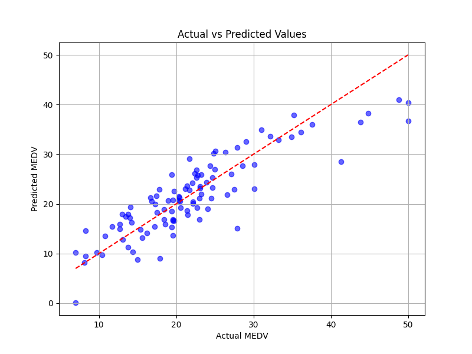

# Boston Housing Price Prediction Using Linear Regression

## Overview

This project implements a Linear Regression model using the Boston Housing dataset to predict the median value of owner-occupied homes (MEDV) based on various socioeconomic and housing-related features.

The model is trained and evaluated using Scikit-Learn, and its performance is assessed using Mean Squared Error (MSE) and R² Score. A scatter plot comparing actual and predicted values is generated to visualize the model's predictive accuracy.

## Dataset

The Boston Housing dataset contains information collected by the U.S. Census Service concerning housing in the Boston metropolitan area.

### Features Used

* CRIM – Per capita crime rate by town
* ZN – Proportion of residential land zoned for large lots
* INDUS – Proportion of non-retail business acres per town
* CHAS – Charles River dummy variable
* NOX – Nitric oxide concentration
* RM – Average number of rooms per dwelling
* AGE – Proportion of owner-occupied units built before 1940
* DIS – Weighted distances to employment centers
* RAD – Accessibility to radial highways
* TAX – Property tax rate per $10,000
* PTRATIO – Pupil-teacher ratio by town

### Target Variable

* MEDV – Median value of owner-occupied homes (in $1000s)

## Technologies Used

* Python
* Pandas
* Scikit-Learn
* Matplotlib

## Machine Learning Workflow

1. Load the Boston Housing dataset.
2. Select input features and target variable.
3. Split the dataset into training and testing sets.
4. Train a Linear Regression model.
5. Evaluate model performance using:

   * Mean Squared Error (MSE)
   * R² Score
6. Visualize actual versus predicted house prices.

## Results

The model generates predictions for housing prices and evaluates performance on both training and testing datasets.

### Actual vs Predicted Values



## Project Structure

```text
Boston-Housing-Regression/
│
├── boston_housing.py
├── actual_vs_predicted.png
├── BostonHousing.csv
├── README.md
└── requirements.txt
```

## Installation
# Boston Housing Price Prediction Using Linear Regression

## Overview

This project implements a Linear Regression model using the Boston Housing dataset to predict the median value of owner-occupied homes (MEDV) based on various socioeconomic and housing-related features.

The model is trained and evaluated using Scikit-Learn, and its performance is assessed using Mean Squared Error (MSE) and R² Score. A scatter plot comparing actual and predicted values is generated to visualize the model's predictive accuracy.

## Dataset

The Boston Housing dataset contains information collected by the U.S. Census Service concerning housing in the Boston metropolitan area.

### Features Used

* CRIM – Per capita crime rate by town
* ZN – Proportion of residential land zoned for large lots
* INDUS – Proportion of non-retail business acres per town
* CHAS – Charles River dummy variable
* NOX – Nitric oxide concentration
* RM – Average number of rooms per dwelling
* AGE – Proportion of owner-occupied units built before 1940
* DIS – Weighted distances to employment centers
* RAD – Accessibility to radial highways
* TAX – Property tax rate per $10,000
* PTRATIO – Pupil-teacher ratio by town

### Target Variable

* MEDV – Median value of owner-occupied homes (in $1000s)

## Technologies Used

* Python
* Pandas
* Scikit-Learn
* Matplotlib

## Machine Learning Workflow

1. Load the Boston Housing dataset.
2. Select input features and target variable.
3. Split the dataset into training and testing sets.
4. Train a Linear Regression model.
5. Evaluate model performance using:

   * Mean Squared Error (MSE)
   * R² Score
6. Visualize actual versus predicted house prices.

## Results

The model generates predictions for housing prices and evaluates performance on both training and testing datasets.

### Actual vs Predicted Values


## Project Structure

```text
Boston-Housing-Regression/
│
├── boston_housing.py
├── actual_vs_predicted.png
├── BostonHousing.csv
├── README.md
└── requirements.txt
```

## Installation

Clone the repository:

```bash
git clone https://github.com/marorabe25-pixel/Boston-Housing-Regression.git
cd Boston-Housing-Regression
```

Install required libraries:

```bash
pip install pandas scikit-learn matplotlib
```

## Running the Project

```bash
python boston_housing.py
```

## Performance Metrics

* Mean Squared Error (MSE)
* R² Score (Coefficient of Determination)

These metrics help evaluate the accuracy and reliability of the regression model.

## Author

Created as a machine learning project demonstrating regression analysis using the Boston Housing dataset and Scikit-Learn.


Install required libraries:

```bash
pip install pandas scikit-learn matplotlib
```

## Running the Project

```bash
python boston_housing.py
```

## Performance Metrics

* Mean Squared Error (MSE)
* R² Score (Coefficient of Determination)

These metrics help evaluate the accuracy and reliability of the regression model.

## Author

Created as a machine learning project demonstrating regression analysis using the Boston Housing dataset and Scikit-Learn.
